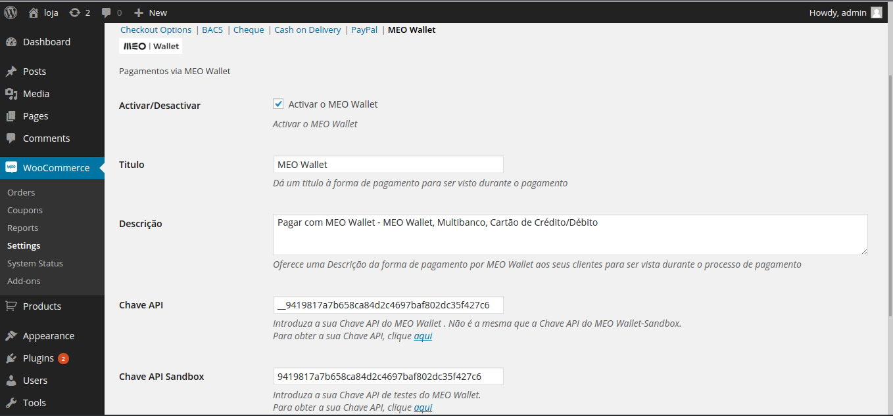
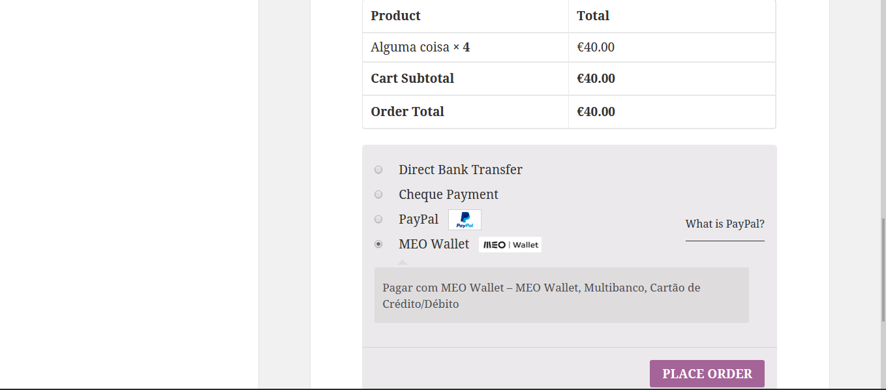
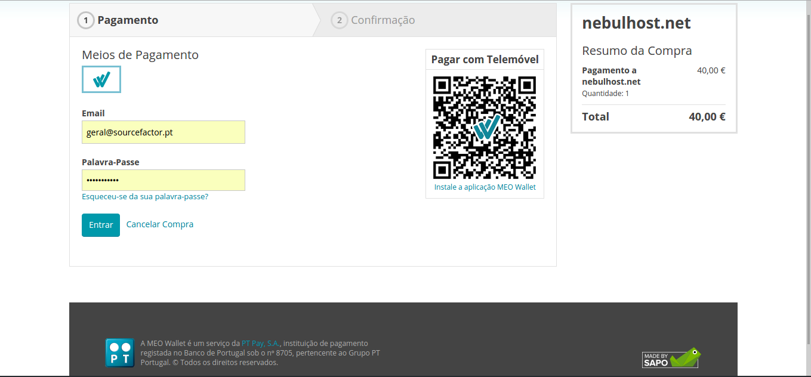

=== MEO Wallet ===

Contributors: jquiterio

Donate link: https://jquiterio.eu

Tags: meowallet, payment, gateway

Requires at least: 3.0.1

Tested up to: 4.1.1

Stable tag: 1.9

License: GPLv3

License URI: http://www.gnu.org/licenses/gpl-2.0.html

MEO Wallet is a plugin for Wordpress/WooCommerce that provides possibility for marchants to accept payments from Wallet.pt

 == Description ==
 
MEO Wallet is a plugin for Wordpress/WooCommerce that provids possibility to marchants accept payment from Wallet.pt.

The main purpose of __MEO Wallet__ Plugin is to act as payment gateway for *WooCommerce*.
Users will be redirected to *MEO Wallet website* where can pay via __MEO Wallet Credit__, __Multibanco__ (The Portuguese payment method), __Credit and Debit Cards__.

== Installation ==

This section describes how to install the plugin and get it working.

*Requirements*

- WooCommerce 2.1 or Later.
- PHP cURL Installed on the Server.
- PHP JSON Installet on the Server.

**Manual Installation**

1. Upload `meowallet` (inside .zip file) folder to the `/wp-content/plugins/` directory.
2. Activate the plugin through the 'Plugins' menu in WordPress.
3. Go to WooCommerce->Settings->Checkout and Click on **MEO Wallet**.
4. Configure Settings such as Sandbox (test environment), Sandbox API Key and Live API Key.

*Automatic Installation*
1. Go to the Menu `Plugins` in Wordpress and Click on `Add New`, then on `Upload Plugin`.
2. Clik on `Choose File` and select the `meowallet.zip` compressed file from your disk, click `Open`, than backing on the Wordpress Paga click on `Install Now`.
3. Once Installed, Click on `Active Plugin` to active MEO Wallet.
4. Go to WooCommerce->Settings->Checkout and Click on **MEO Wallet**.
5. Configure Settings such as Sandbox (test environment), Sandbox API Key and Live API Key.

Notes:
The the Sandbox environment only provides a fake payment. So its not real.

== Frequently Asked Questions ==

== Its possible to Pay with VISA Card =
Yes, Its possible to pay with VISA Cars 

== I've a MEO Wallet Account and do not have money in there. How can I do? ==
You can go to your [MEO Wallet Account Page](https://www.wallet.pt/login) to add credit cards or transfer money to you Wallet.
Otherwise you Can use Multibanco Payment Method or VISA Card.

== Screenshots ==

==   Changelog ==

= 1.8 =

* Ready integration of Plugin to WooCommerce.
* Added basic services to provide secure payment to MEO Wallet.

= 1.9 =

* Removed transactions status for now. It will be included at 2.0 version.
* Code Cleaning
* Included payment methods accepted by MEO Wallet on ckeckout image.

== Upgrade Notice ==

For now, only its possible to check if payment is done from MEO Wallet Mechant Page.

== Adictional information ==

"MEO" and "MEO Wallet" are services from PT Portugal, SGPS, SA "PT Portugal", SAPO and other associated with PT Portugal. For more information, plese contact [PT Portugal](http://www.telecom.pt/) and/or [SAPO](http://www.sapo.pt)

